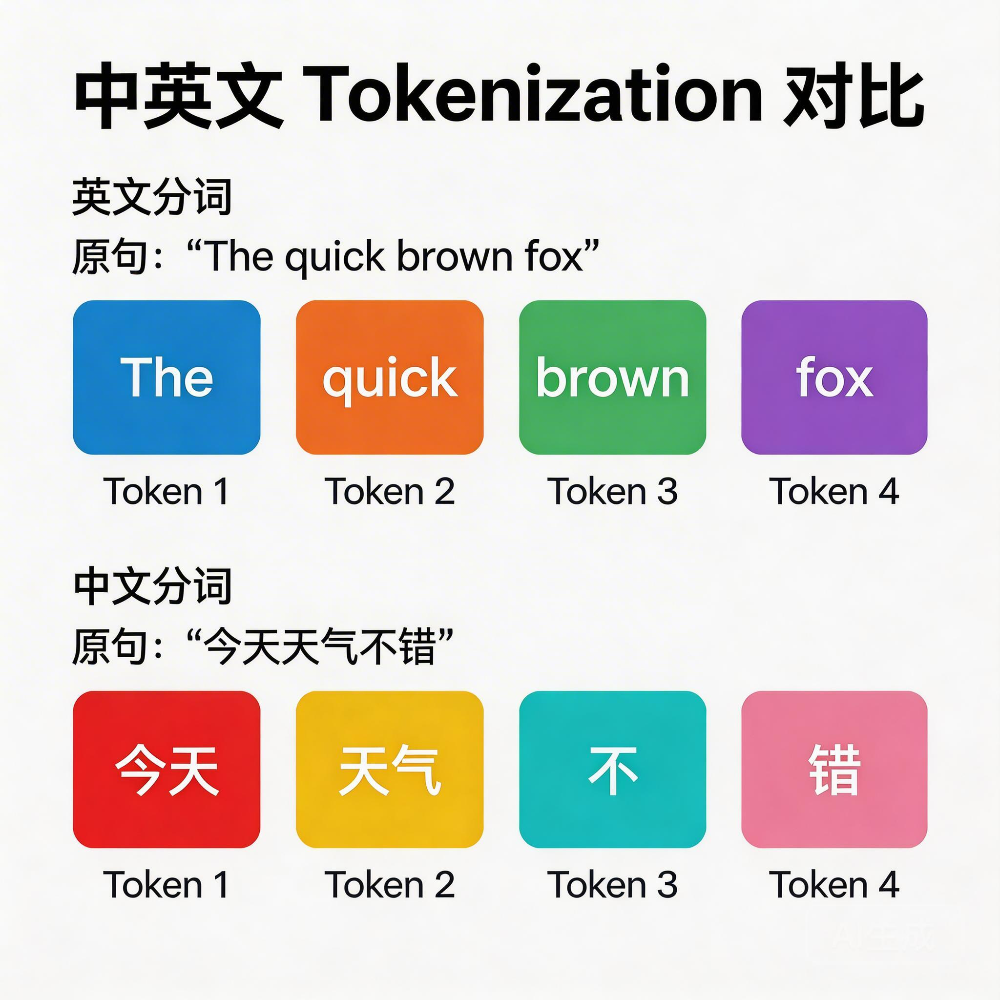
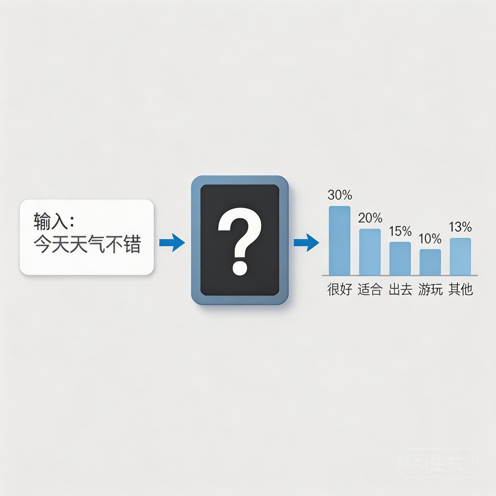

# LLM 在解决什么问题？从 Token 到预测的本质

你有没有用过手机输入法的"联想"功能？

当你打出"今天天气"四个字，输入法会贴心地提示"不错"、"很好"、"怎么样"。你按下回车，一句话就完成了。

这个功能，和 ChatGPT 有什么区别？

答案可能会让你意外：**它们在做同一件事，只是"水平"不同。**

这件事就是——**预测下一个可能出现的文字**。

ChatGPT 能写代码、写论文、回答复杂问题，本质上都是因为它把这件事做得足够好。好到什么程度？好到我们开始怀疑它是不是真的"理解"了我们在说什么。

但在讨论"理解"之前，让我们先搞清楚一个更基础的问题：

**它到底在解决什么问题？**

---

## 一、语言模型的核心任务

把问题说得更精确一点：

> 给定一段文字，预测下一个可能是什么。

就这么简单。

你可以把它想象成一个超级复杂的"填空题"。题目给你"床前明月光，疑是地上__"，你要填出"霜"。

但语言模型要做的，远比填出一首诗复杂。它需要处理：

- **日常对话**："我今天好累"后面可能接"早点休息"、"怎么了"、"去睡吧"……
- **专业文本**："这个函数的时间复杂度是 O(n)"后面可能接"所以"、"这意味着"、"但是"……
- **代码**：`def fibonacci(n):` 后面可能接 `if n <= 1:`、`return`、缩进……

每一个空，都需要根据上下文来判断。**上下文越长，信息越多，判断就越准确。**


---

### 从输入法到 ChatGPT：同一个问题，不同段位

现在你明白了：输入法联想和 ChatGPT 在做同一件事。

那为什么 ChatGPT 能写代码，输入法不行？

**因为它"看"得更多，"想"得更深。**

| 能力 | 输入法联想 | ChatGPT |
|------|-----------|---------|
| 看过的文本量 | 你的历史输入 + 通用语料 | 几乎整个互联网 |
| "思考"深度 | 只看前几个词 | 看完整的上下文 |
| 预测准确度 | 能猜对常用搭配 | 能猜对复杂逻辑 |

打个比方：输入法像是只背过常用短语的新手，ChatGPT 像是读完了整个图书馆的学者。**他们在做同一道题，但知识储备差了几个量级。**

这里有一个反直觉的点：

> 模型不需要"真正理解"语言，它只需要预测得足够准。

但为了预测得准，它不得不"学会"语言的规律——语法、语义、逻辑、甚至常识。**这些能力是"预测下一个词"这个任务的副产品。**

---

## 二、Token：让机器处理文字的基本单位

好，现在我们知道语言模型要做什么了：预测下一个"东西"。

但这个"东西"是什么？

是字符？是单词？还是别的什么？

### 计算机眼中的文字

计算机不认识文字。在它眼里，一切都是数字。

最朴素的想法是：把每个字符变成一个数字。比如 ASCII 码，`A` 是 65，`a` 是 97。

但这样做有个问题：字符太"碎"了。

想象一下，模型要预测 "apple" 的下一个词。如果按字符处理，它需要连续预测 5 次：`a` → `p` → `p` → `l` → `e`。效率低不说，还容易丢失语义信息。

那按单词处理呢？

也不行。英语还好，中文怎么办？"人工智能"是一个词还是四个词？"神经网络"呢？

### Token：一个折中的智慧

工程师们找到了一个折中方案：**Token（词元）**。

Token 介于字符和单词之间，是通过算法自动学习出来的"最优切分单位"。

看看实际例子：

**英文 "unhappiness"：**
```
un | happ | iness
```
被切成 3 个 Token。为什么？因为 `un-` 是常见前缀，`-ness` 是常见后缀，`happ` 是词根。这样切分，模型更容易学到规律。

**中文 "人工智能"：**
```
人工 | 智能
```
或者可能被切成：
```
人 | 工 | 智 | 能
```
取决于这个词在训练数据中出现的频率。高频词更可能被切成一个整体。



### Token 带来的影响

Token 不仅仅是技术细节，它决定了模型的"世界观"。

模型见过的所有 Token 组成一个**词表（Vocabulary）**。这个词表通常有 5 万到 15 万个 Token。

这意味着：

1. **模型只能"说"词表里有的东西**。如果词表里没有某个专业术语，模型就永远无法准确输出它。
2. **不同语言的效率不同**。中文通常比英文需要更多 Token 来表达同样的内容，这意味着更高的成本。
3. **Token 的边界就是模型认知的边界**。一个被切成碎片的词，模型可能难以理解它的完整含义。

---

## 三、预测下一个 Token：问题清楚了，但怎么算？

现在问题定义得足够清晰了：

> 输入：一串 Token
> 输出：下一个 Token 的概率分布

输入 `[今天, 天气, 不错]`，输出可能是 `{很好: 0.3, 适合: 0.2, 出去: 0.15, ...}`。

**但怎么算出这个概率分布？**

### 朴素想法：统计

最直觉的方法：统计历史上"不错"后面都跟了什么。

如果过去 1000 次出现"不错"，有 300 次后面是"很好"，那概率就是 30%。

这个方法叫 **N-gram 模型**，在 2000 年代之前是主流。

但它有致命缺陷：

**组合爆炸。**

假设我们想根据前 10 个词来预测第 11 个词。如果词表有 5 万个词，可能的组合数量是 `50000^10`。这个数字比宇宙中的原子还多。

根本统计不完。

### 我们需要的是：一个能"学习"的函数

统计不行，我们需要另一种方法：

**一个函数，能从海量数据中自动学习规律，而不是穷举所有可能。**

这个函数需要满足几个条件：

1. **能吃进去任意长度的 Token 序列**
2. **能吐出下一个 Token 的概率分布**
3. **能从数据中自动学习，不需要人工写规则**
4. **足够强大，能捕捉语言的复杂规律**



这个"理想函数"就是语言模型的核心。

在深度学习时代之前，人们尝试过各种方法：隐马尔可夫模型、条件随机场、循环神经网络……它们都有各自的局限。

直到 2017 年，一篇论文改变了 everything。

那篇论文叫《Attention Is All You Need》，它提出的架构叫 **Transformer**。

---

## 四、核心认知

在进入 Transformer 之前，让我们先记住几个关键点：

**1. LLM 的本质是预测，不是"思考"**

模型没有"想"这个动作。它只是在执行一个数学运算：给定输入，计算概率。

但为了算得准，它不得不学会语言的规律。这种"被迫学会"的能力，就是我们看到的"智能"。

**2. Token 是模型的基本单位**

模型不理解"字符"或"单词"，它只理解 Token。Token 的切分方式，决定了模型看待世界的方式。

**3. 我们需要一个强大的"预测函数"**

统计方法不够用。我们需要一个能从数据中学习的函数，它能捕捉语言的复杂规律，同时不会因为组合爆炸而崩溃。

这个函数，就是下一节课的主角：**Transformer**。

---

## 思考题

试试这道题：

> **"这个律师就像一条__"**

你会填什么？

鲨鱼？因为律师要凶狠、要赢？
狗？因为……忠诚？
蛇？因为狡猾？

不管你填什么，我猜你脑子里一定闪过了"律师"这个职业的刻板印象，然后找到了一个"气质匹配"的动物。

**但模型没见过真正的律师，也没去过动物园。** 它只是在海量文本中，见过无数次"律师"这个词和某些形容词同时出现。

那问题来了：

> 如果模型只是"统计共现"，它真的"理解"什么是律师、什么是鲨鱼吗？
>
> 还是说，所谓的"理解"，本质上就是一种"足够复杂的统计"？

这个问题，没有标准答案。但它值得你在学习后续内容时，一直放在心里。

---

**下一课预告**：Transformer 是怎么设计出这个"预测函数"的？为什么说"注意力机制"是它的灵魂？
