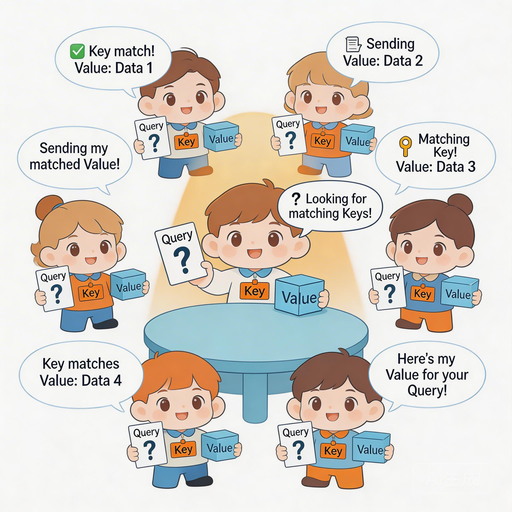
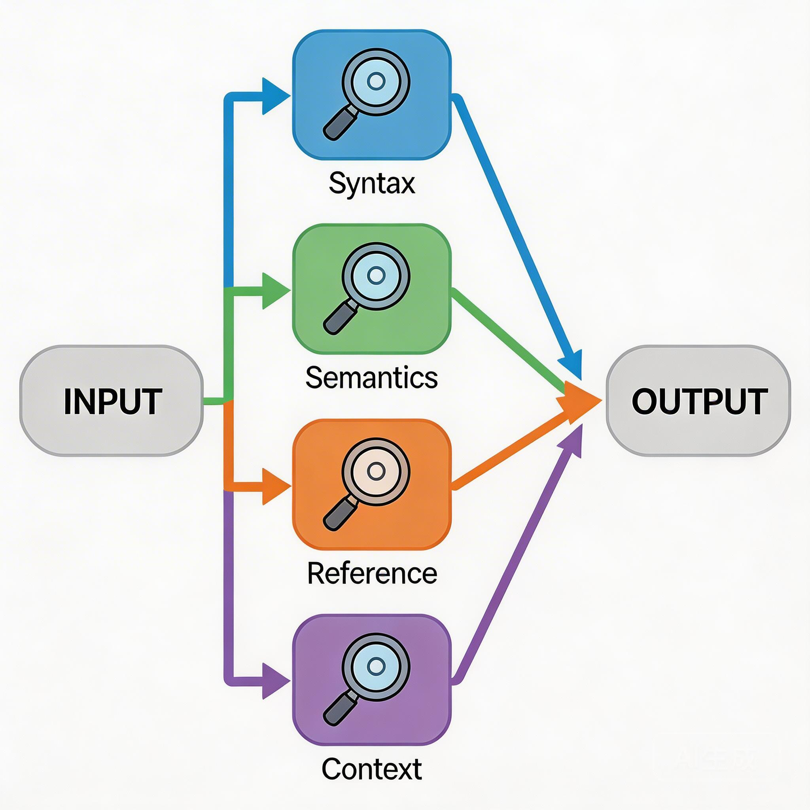
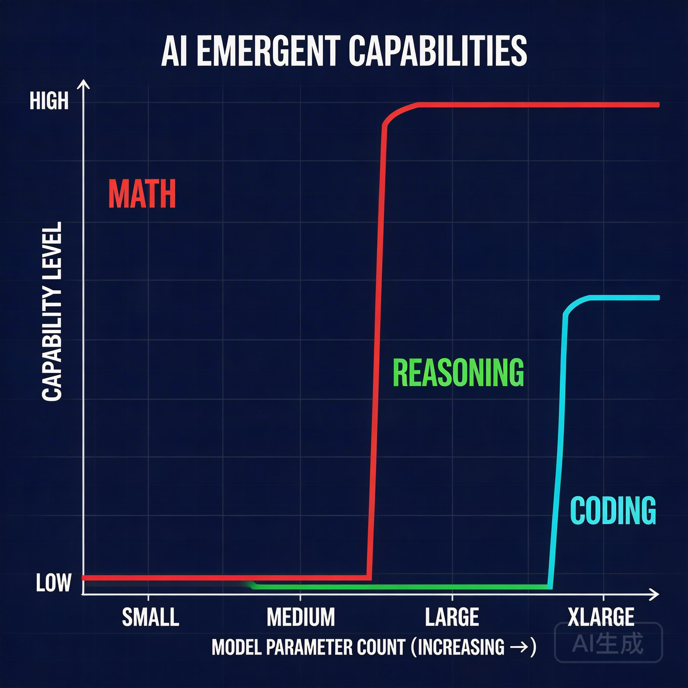
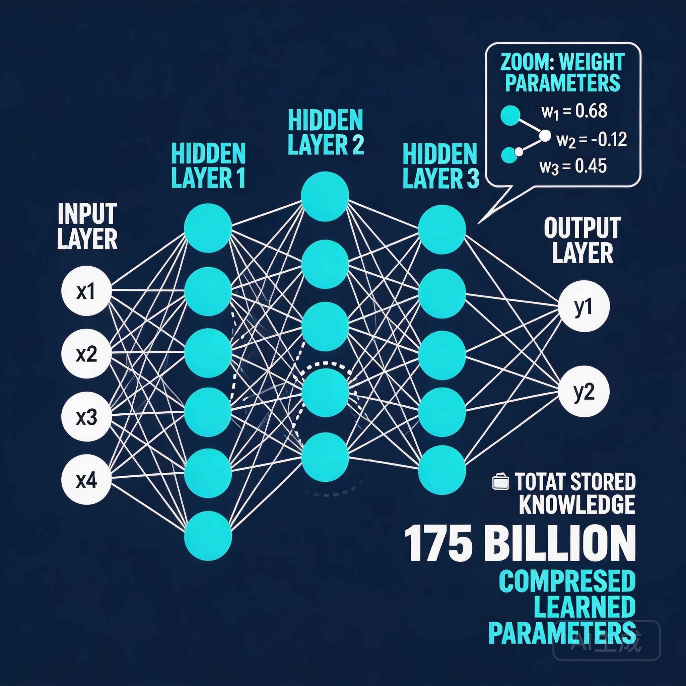
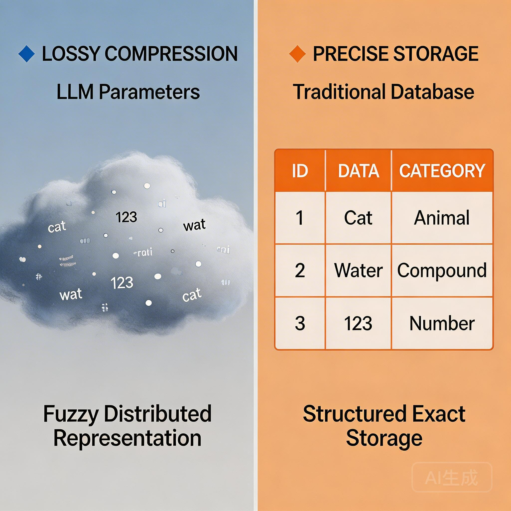

# Transformer：让每个词"看见"所有词

上一节课，我们搞清楚了语言模型在做什么：**预测下一个 Token**。

我们也留下了一个问题：怎么设计一个函数，能吃进一串 Token，吐出下一个 Token 的概率分布？

这个函数要满足几个条件：
- 能处理任意长度的输入
- 能捕捉语言的复杂规律
- 能从海量数据中自动学习

今天这节课，我们就来拆解这个"函数"到底长什么样。

它是现代大模型的基石——**Transformer**。

---

## 一、RNN 的困境：一步一回头

在 Transformer 诞生之前，处理序列数据的王者是 **RNN（循环神经网络）** 和它的升级版 **LSTM**。

它们的思路很直觉：**像人读书一样，从左到右一个一个处理。**

读第一个词，更新一下"记忆"；读第二个词，再更新一下"记忆"……以此类推。每一步，模型都拿着当前的词和上一步的"记忆"，算出新的"记忆"。

这个设计很优雅，但有一个致命问题：

### 问题一：无法并行

因为第 100 个词的"记忆"依赖于第 99 个词，第 99 个依赖于第 98 个……你必须老老实实从第一个词开始，一步步往后算。

**这意味着：无法利用 GPU 的并行能力。**

GPU 最擅长的是"同时算一万件事"。但 RNN 强迫你"一件事一件事地算"，这就把 GPU 的威力废了一大半。

结果就是：训练特别慢。同样的数据量，RNN 要花几倍甚至几十倍的时间。

### 问题二：信息衰减

更麻烦的是，当句子变长时，**开头的信息会"衰减"**。

想象一下：你读一篇 5000 字的文章，读到第 3000 字时，你还记得开头第 50 字写的是什么吗？

大概率不记得了。

RNN 也一样。当它处理到句尾时，句首的信息已经被"稀释"了无数次。虽然 LSTM 引入了"门控机制"来缓解这个问题，但本质上还是治标不治本。

这就导致了一个尴尬的现象：**模型"看"到了全文，但"记住"的只有尾巴。**

### 一个思想实验

假设你要理解这句话：

> "因为昨天熬夜写代码，今天开会时我差点睡着，但咖啡救了我。"

如果要预测"咖啡"后面是什么，你需要：
- 知道"我差点睡着"（中间）
- 知道"原因是熬夜"（开头）
- 知道"咖啡"的作用是提神（常识）

RNN 读到"咖啡"时，"熬夜"和"写代码"这些信息已经被稀释得很淡了。它可能只记得"差点睡着"，但忘了"为什么"。

**这就是 RNN 的天花板：它不是"不想"记住，而是"记不住"。**

---

## 二、Transformer 的破局：一眼看完全文

2017 年，Google 的一篇论文《Attention Is All You Need》提出了一种全新的架构。

它的核心思想是：

> **不再一步一步读，而是一眼看完全文。**
> **让每个词都能直接"看见"所有其他词。**

这听起来很直觉，但怎么实现呢？

### Self-Attention：一场圆桌会议

想象一下，句子里的每个词都围坐在一张圆桌旁，开一场"信息交流会"。

假设我们有一句话：

> "小明养了一只猫，它很可爱。"

圆桌旁坐着：**小明、养、了、一、只、猫、它、很、可爱**。

每个人都带着三样东西：

| 我带着什么 | 类比 | 作用 |
|------------|------|------|
| **Query（我的问题）** | 举着一块牌子，写着我关心什么 | "我在找什么类型的信息？" |
| **Key（我的标签）** | 胸前挂着的名牌 | "我能提供什么类型的信息？" |
| **Value（我的内容）** | 手里拿着的实际内容 | "我的具体内容是什么？" |

### 会议怎么开？

会议规则很简单：**每个人轮流发言，向所有人提问，然后根据回答的相关性来"分配注意力"。**

轮到"它"发言时：

**第一步："它"举起 Query 牌子**

"我在找一个可以被形容为'可爱'的对象。"

**第二步：每个人展示自己的 Key（名牌）**

| 参会者 | Key（名牌内容） |
|--------|-----------------|
| 小明 | "我是一个人" |
| 养 | "我是一个动词" |
| 猫 | "我是一个动物" |
| 它 | "我是一个代词" |
| 可爱 | "我是一个形容词" |
| ... | ... |

**第三步："它"评估每个人的相关度**

"它"看看每个人的名牌，心想：
- 小明说自己是人……人不常被形容为"可爱"，相关度 **10%**
- 猫说自己是动物……猫经常被形容为"可爱"，相关度 **80%**
- 养说自己是动词……完全不相关，相关度 **5%**
- ...

这就是**注意力权重**——每个词根据自己的 Query 和别人的 Key，算出"应该分配多少注意力"。

**第四步：加权收集信息**

"它"根据权重，从每个人那里收集信息：
- 从"小明"那里拿 10% 的内容
- 从"猫"那里拿 80% 的内容
- 从"养"那里拿 5% 的内容
- ...

**结果："它"现在的表示里，融合了"猫"的大部分信息。它"知道"自己指的是猫了。**

### 这套机制的精妙之处

**每个人同时既是"提问者"也是"被问者"。**

- 当"它"在找信息时，它是提问者（Query）
- 当"猫"在回答"它"时，"猫"是被问者（Key + Value）
- 但"猫"也会发起自己的 Query，去找和它相关的信息

这就是为什么叫 **Self-Attention（自注意力）**——所有人都在同一张桌子上，互相交流，互相"注意"。

### Multi-Head：同时开好几场会议

但一句话里的关系可能不止一种。

"它"可能需要知道：
- 语法关系：它是一个代词，做主语
- 指代关系：它指的是猫
- 情感关系：它是可爱的

为了捕捉这些不同类型的"关系"，Transformer 使用了**多头注意力（Multi-Head Attention）**。

想象一下，**同时开了好几场圆桌会议**：
- 会议 A 专门讨论"语法关系"
- 会议 B 专门讨论"指代关系"
- 会议 C 专门讨论"情感关系"

每个"头"就是一场独立的会议，学习一种特定类型的关系。最后，把所有会议的结论拼起来，就得到了完整的理解。

### 并行化：为什么 Transformer 这么快？

因为每个人都可以**同时**向所有人提问（不需要等上一个人问完），所以**整个会议可以并行进行**。

RNN 像是"传话游戏"——必须一个接一个传，不能跳过。
Transformer 像是"圆桌讨论"——所有人同时交流，效率极高。

这就是 Transformer 能在 GPU 上高效训练的根本原因。同样是训练 1000 亿词的数据，Transformer 可能只需要 RNN 十分之一的时间。

**这个效率的提升，是"大模型时代"能够到来的技术前提。**

---

## 三、涌现：为什么"大"就是"强"？

你可能在新闻里看到过：GPT-3 有 1750 亿参数，GPT-4 估计有上万亿。

为什么要把模型做得这么大？

答案是一个神奇的现象：**涌现（Emergence）**。

### 什么是涌现？

简单说：**某些能力只有在模型大到一定程度后，才会突然出现。**

在小模型上，你怎么训练，它都学不会做三位数加法。但参数量一旦超过某个阈值，它的数学能力就像开关被打开了一样，突然就会了。

这不是线性的"逐渐变好"，而是非线性的"突然涌现"。

### 为什么会涌现？

目前科学界还没有定论，但有两种主流解释：

**解释一：临界质量**

想象你在拼一个 1000 片的拼图。当你拼到第 500 片时，可能还是一头雾水。但拼到第 800 片时，突然"顿悟"了——原来这拼的是埃菲尔铁塔！

模型也一样。当参数量达到某个临界值，它"看到"的模式足够多，就能形成更高级的抽象。

**解释二：组合能力**

小模型可能学会了 A、B、C 三种基础能力。但只有大模型才能把它们**组合**起来，形成 D 这种复杂能力。

比如：
- A：理解问题
- B：检索知识
- C：组织语言
- D（组合）：回答问题

小模型学会了 A、B、C，但不知道怎么配合。大模型不仅学会了各自的能力，还学会了"怎么组合使用"。

### 这意味着什么？

涌现告诉我们一件事：

> **"智能"可能是"规模"的副产品。**

这不是说"越大越好"，而是说：某些能力，只有在足够大的规模下才能解锁。

---

## 四、知识存在哪里？

有了架构（Transformer），有了规模（涌现），模型终于"学会"了各种能力。

但学到的**知识**，到底存在哪里？

**答案：压缩在神经网络的参数里。**

### 神经网络长什么样？

想象一张巨大的网：

- **输入层**：接收 Token
- **隐藏层**：几十层甚至上百层，每层有上亿个"神经元"
- **输出层**：输出下一个 Token 的概率

每一层之间，有无数条"连线"。每条连线上有一个**权重（Weight）**——这就是**参数**。

GPT-3 有 1750 亿个参数。你可以把它们想象成 1750 亿个小旋钮。训练的过程，就是不断调整这些旋钮，让模型的预测越来越准。

### 训练：把互联网"压缩"进参数

训练分两步：

**第一步：预训练**

把互联网上的海量文本（网页、书籍、代码……）喂给模型，让它不断练习"预测下一个词"。通过这种方式，模型学会了语言的规律，也"记住"了各种知识。

**第二步：微调 + 对齐**

教模型"像助手一样回答问题"，而不是"续写文本"。这一步让模型从"话痨"变成了"助手"。

**关键点：知识是在预训练阶段被"压缩"进参数的。**

### 知识是怎么"存"进去的？

预训练时，模型读了互联网上的几万亿个词。这些词里包含的信息，被"压缩"进了 1750 亿个参数里。

**这个过程类似于"有损压缩"：**

- 原始信息：几万亿个词（几千 TB）
- 压缩后：1750 亿个参数（约 350 GB）
- 压缩比：几万倍

因为是"有损压缩"，所以：
- **常见的信息会被保留**：比如"法国首都是巴黎"
- **罕见的信息可能丢失**：比如某个小众领域的技术细节
- **细节可能模糊**：模型可能"记得"某件事，但记不清具体细节

### 这带来两个重要后果

**后果一：知识是"凝固"的**

模型的参数在训练完成后就固定了。这意味着：

- **它不知道训练截止日期之后发生的事**：2023年训练的模型，不知道2024年的新闻
- **无法"更新"某个具体知识点**：你不能告诉它"从现在开始，法国首都是里昂"，除非重新训练

这被称为**知识时效性困境**。

**后果二：知识是"模糊"的**

因为是有损压缩，模型对知识的"记忆"不是精确的：

- 它可能"知道"某个事实，但说出来的细节有误
- 它可能把两件事混淆
- 它可能在不确定的时候"编造"一个看起来合理的答案（这就是幻觉的来源之一）

这被称为**知识精确性困境**。

---

## 总结

这节课，我们拆解了现代大模型的"心脏"——Transformer，以及知识的本质。

**三个关键点：**

1. **Transformer 的核心创新**：让每个词都能直接"看见"所有其他词，通过注意力机制分配"关注度"。这解决了 RNN 的两大痛点：无法并行、信息衰减。

2. **规模带来涌现**：某些能力只有在参数量大到一定程度后才会"涌现"。智能可能是规模的副产品。

3. **知识压缩在参数里**：这意味着知识是"凝固"的（无法更新）和"模糊"的（可能出错）。

**这些困境，催生了后续的技术：**

| 原生困境 | 解决技术 | 所在章节 |
|----------|----------|----------|
| 无法稳定遵循指令 | Prompt Engineering | 第二章 |
| 知识固化、无法更新 | RAG | 第三章 |
| 上下文有限、易迷失 | Context Engineering | 第三章 |
| 只能输出文本、无法行动 | Tool Calling / MCP | 第四章 |
| 行为不可控、幻觉难消除 | Harness Engineering | 第五章 |

但在此之前，我们需要先搞清楚一件事：**这些"困境"具体表现成什么样？它们会给实际使用带来什么问题？**

这正是下一节课的主题。

---

## 思考题

> 如果模型的知识是"压缩存储"在 1750 亿个参数里的，你觉得能让它"忘记"某个具体事实吗？

比如，有人要求模型"忘掉某个人的名字"或"删除某条敏感信息"。

直接改参数？1750 亿个参数，你不知道哪个存了这条信息。

重新训练？成本太高。

有没有什么办法，可以在不重新训练的情况下，"修改"模型的知识？

这个问题，目前业界还在探索。但你的思考，可能会让你对"模型记忆"这件事有更深的理解。
