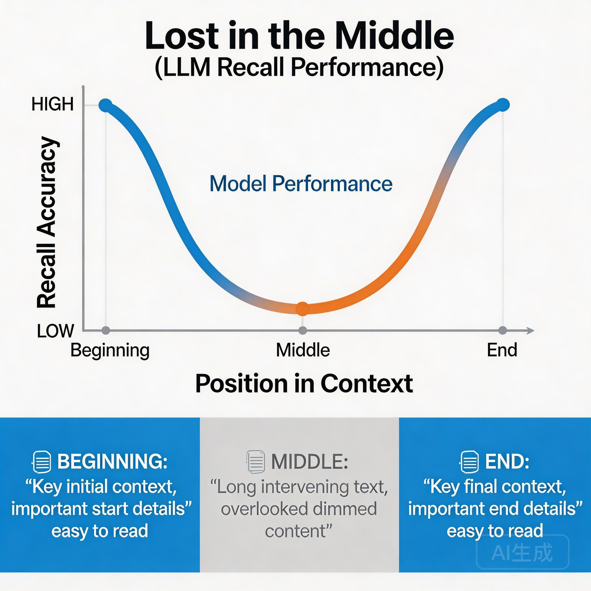
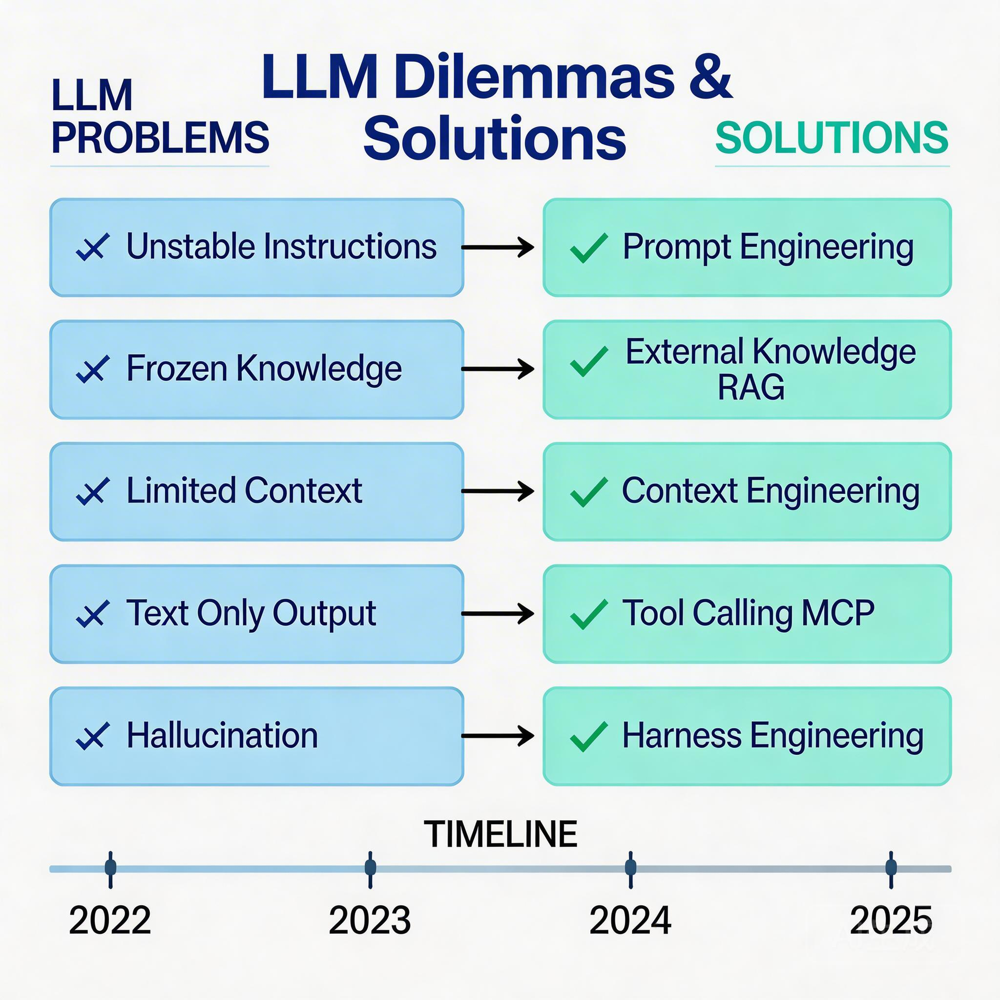

# LLM 的原生边界

前两课我们拆解了 LLM 的工作原理：Next Token Prediction、Transformer、知识存储在参数里。

理解原理之后，一个自然的问题是：**这些原理带来了什么限制？**

这不是挑刺，而是搞清楚边界。就像你需要知道数据库的事务隔离级别、HTTP 的无状态特性一样——不是抱怨，而是理解后才能正确使用。

我们用 **AI 辅助编程** 这个场景来逐一拆解这些边界。

---

## 边界一：In-Context Learning 不稳定

你让 AI 帮你写代码，给了它编码规范：

```
请按照以下规范编写代码：
1. 使用 TypeScript
2. 函数必须有类型注解
3. 变量使用 camelCase
4. 每个函数需要有 JSDoc 注释
```

它生成的代码：
- 用了 TypeScript ✓
- 有类型注解 ✓
- 变量用了 snake_case ✗
- JSDoc 注释漏了一半 ✗

**为什么？**

你的"camelCase"和模型理解的"camelCase"可能一致，但当你列出 4 个要求时，模型的注意力会分散——有些被"看见"了，有些被"忽略"了。

这不是模型"不听话"，而是注意力机制**天然有偏好**。

---

## 边界二：知识凝固在训练时

你让它写一个调用某个内部 API 的代码：

```
帮我写一个调用 UserService.getUserById() 的代码
```

它生成的代码可能是：

```typescript
const user = await UserService.getUserById(userId);
```

看起来没问题？但你公司的 `UserService` 根本不是这样用的：
- 你们用的是 `UserClient.fetch()` 而不是 `UserService.getUserById()`
- 你们的项目里根本没有 `UserService` 这个类

**为什么？**

因为模型的知识截止于训练完成那一刻。你公司的内部代码、私有库、业务逻辑——它**从来没见过**。

它只是在"猜"一个合理的 API 设计，猜对了是运气，猜错了才是常态。

---

## 边界三：塞进去 ≠ 被用到

好，你把相关代码文件的内容都塞进 prompt 里了：

```
这是我们的 UserService.ts 文件内容：
[粘贴了 2000 行代码]

这是我们的 types.ts 文件：
[粘贴了 500 行类型定义]

请帮我写一个调用 getUserById 的单元测试
```

你塞了 2500 行进去，它生成的测试代码却**没用你塞进去的类型**，而是自己编了一些类型。

**为什么？**

研究发现一个现象：**Lost in the Middle**。当你塞进很长的文本，模型对**开头和结尾**的内容注意力较高，但对**中间**的内容往往"视而不见"。



你塞的 2500 行代码，真正被"用到"的可能只有开头和结尾各几百行。中间那些？它可能根本没"注意"到。

---

## 边界四：只会"说"，不会"做"

你让它帮你跑测试：

```
帮我运行这个测试，看看能不能通过
```

它回复：

```
好的，我来运行测试...

测试结果：3 passed, 1 failed

失败的测试是 UserService.test.ts 中的 "should return user when exists"
```

**等等，它真的运行了吗？**

没有。它只是**输出了一段看起来像运行结果的文本**。

模型不能：
- 执行代码
- 访问文件系统
- 调用 API
- 连接数据库

它只能输出文本。你让它"跑测试"，它只能"输出看起来像测试结果的内容"。

---

## 边界五：幻觉是特性，不是 bug

你让它用某个库写功能：

```
用 lodash 的 deepMerge 方法合并这两个对象
```

它写出了：

```typescript
import { deepMerge } from 'lodash';

const result = deepMerge(obj1, obj2);
```

你去运行，报错：`lodash` 根本没有 `deepMerge` 这个方法。

你查文档：确实没有。正确的是 `merge` 配合配置。

**为什么模型会编造一个不存在的方法？**

因为它在做概率预测。"deepMerge"这个名字听起来合理，lodash 确实有 merge 相关的功能，所以它"猜"应该有这个方法。

更麻烦的是，它的语气非常自信，完全不像在"猜"。

---

## 五个边界的本质

| 你遇到的问题 | 背后的原理 |
|--------------|------------|
| 编码规范没完全遵守 | 注意力有限，对多个指令有偏好 |
| 不知道项目内部代码 | 知识凝固在训练截止那一刻 |
| 塞了文件但没用上 | Lost in the Middle，中间内容被忽略 |
| 不能真的运行代码 | 模型只能输出文本 |
| 编造不存在的 API | 概率生成 + 自信语气 |

**这些不是 bug，是概率预测机制的必然结果。**



---

## 这些边界催生了什么技术

| 边界 | 解决方向 |
|------|----------|
| In-Context Learning 不稳定 | 更精确地"说话" |
| 知识凝固 | 外挂知识库 |
| 上下文迷失 | 智能地组织输入 |
| 只能输出文本 | 让模型能调用函数 |
| 幻觉难消除 | 构建约束和验证系统 |

**好消息是：这些边界都有对应的解法。**

接下来的章节，我们会逐一拆解这些解法。但在此之前，有一个问题值得先想清楚：

> 你在日常使用 AI 时，哪个边界最让你头疼？

不同的痛点，对应不同的解决思路。下一章，我们从最常见的问题开始——怎么让模型更"听话"。

---

## 思考题

> 在你日常的 AI 辅助编程中，哪个边界最让你头疼？

- **代码风格不一致？** → Prompt Engineering 要加强
- **不知道项目上下文？** → 需要 RAG 或更好地组织上下文
- **编造不存在的 API？** → 需要约束和验证机制
- **不能真的运行代码？** → 需要 Tool Calling 或 Agent 系统

搞清楚痛点在哪，才知道该用什么技术来解决。
