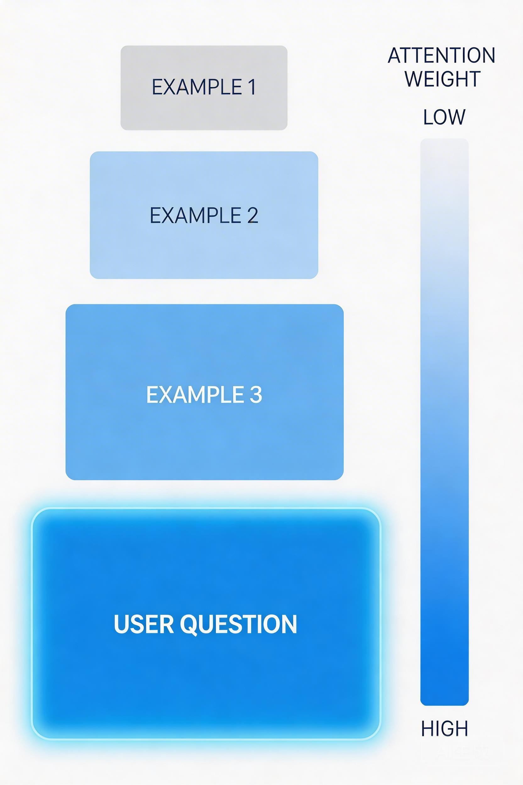
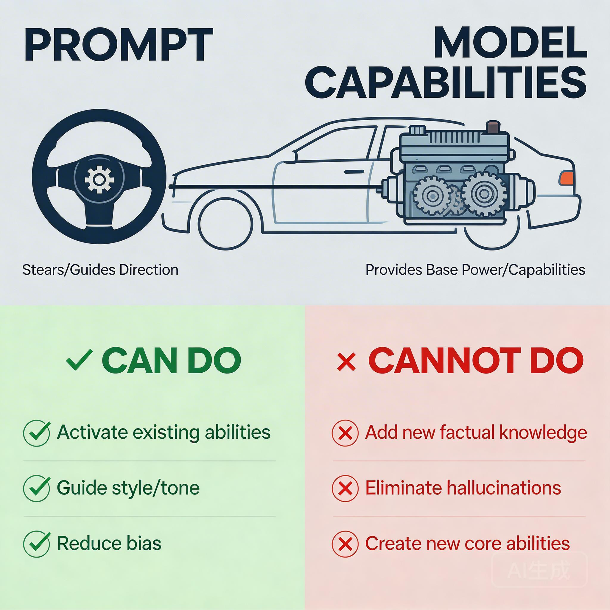

# 提示词工程基础：Zero-shot 到 Few-shot

上一课我们说：**指令遵循不稳定** 是 LLM 的第一个边界。

你让它遵守 4 条编码规范，它只遵守了 2 条。

但这里有个有趣的问题：**模型的权重是冻结的**。你不能改它的参数，那怎么让它"变听话"？

答案是：**通过输入文本，改变它的"激活模式"**。

---

## 为什么改改输入就能改变行为？

第一课我们说过：LLM 的核心是 **Next Token Prediction**——根据前面的所有词，预测下一个词。

这意味着：**你输入的内容，直接决定了模型"看到"什么，进而决定了它会"输出"什么。**

更具体地说，Transformer 的 Self-Attention 机制会根据输入内容计算注意力权重。不同的输入，会产生不同的注意力分布，激活模型参数中不同的"能力模式"。

你可以这样理解：

| 你做的 | 模型发生的 |
|--------|-----------|
| 输入"翻译成英文" | 激活"翻译能力"的参数区域 |
| 输入"用函数式风格重构" | 激活"函数式编程"的参数区域 |
| 输入一个代码例子 | 注意力模式被"引导"到相似的模式 |

**这就是 In-Context Learning 的本质：不是"学习"新知识，而是通过上下文"定位"到模型已有的某个能力模式。**


提示词工程，就是在做这件事：**用正确的方式"说话"，让模型的注意力落在正确的地方。**

---

## Zero-shot：不给例子，直接让它做

最直接的方式：

```
把这段代码重构成函数式风格
```

你没给任何例子，没解释什么是"函数式风格"，直接让它做。

这叫 **Zero-shot**——零样本推理。

### 它为什么能做到？

模型在训练时见过大量代码重构的例子。当你问"重构成函数式风格"时，它激活了训练时学到的"代码重构"能力。

但 Zero-shot 有个问题：**你和模型对"函数式风格"的理解可能不一样**。

你觉得"函数式风格"是：
- 纯函数
- 不可变数据
- 高阶函数

模型理解的"函数式风格"可能是：
- 用 `map`/`filter`/`reduce`
- 避免循环
- 箭头函数

**都是对的，但不完全一致。**

### Zero-shot 什么时候管用？

- 任务足够"通用"：翻译、摘要、简单问答
- 你和模型的"理解"足够对齐：常见编程任务

什么时候不管用？

- 任务太"具体"：按你们公司的编码规范重构
- 概念有歧义：什么样的代码算"优雅"？
- 需要特定格式：输出要符合某个 schema

---

## Few-shot：给几个例子，行为就变了

你发现 Zero-shot 效果不好，于是改成这样：

```
把代码重构成函数式风格。

示例：
输入：
const nums = [];
for (let i = 0; i < 10; i++) {
  nums.push(i * 2);
}

输出：
const nums = Array.from({ length: 10 }, (_, i) => i * 2);

---
输入：
const names = [];
users.forEach(u => names.push(u.name));

输出：
const names = users.map(u => u.name);

现在重构这段代码：
const evens = [];
for (let n of numbers) {
  if (n % 2 === 0) evens.push(n);
}
```

模型输出了：

```javascript
const evens = numbers.filter(n => n % 2 === 0);
```

**完美。** 但你刚才只给了 2 个例子，模型就"学会"了你想要的风格。

### 模型参数变了吗？

**没有。**

那"学习"发生在哪里？

答案：**没有"学习"，只有"激活"**。

你可以这样理解：模型的参数里存储了无数种"能力模式"。你给的例子，就像是**钥匙**，激活了某个特定的能力模式。

更准确地说：

- 训练时：模型学会了各种代码风格（包括函数式）
- 推理时：你的例子告诉它"这次用函数式风格，不是其他风格"

**In-Context Learning 不是"学习"，而是"定位"。**

### 这有什么实际意义？

意味着：
- 你不能通过 Few-shot 让模型学会它训练时没见过的能力
- 但你可以通过 Few-shot 让模型"聚焦"到某个特定能力

---

## 例子怎么给才有效？

### 数量：2-5 个最优

| 例子数量 | 效果 |
|----------|------|
| 0 个 | Zero-shot，理解可能有偏差 |
| 1-2 个 | 明显改善，但可能不够稳定 |
| 3-5 个 | **最佳区间** |
| 10+ 个 | 收益递减，还可能"迷失在中间" |

不是越多越好。例子太多，模型反而可能"忘记"你要它做什么。

### 选择：覆盖边界情况

糟糕的例子选择：

```
输入：1 + 1
输出：2

输入：2 + 2
输出：4

输入：3 + 3
输出：？
```

三个例子都是加法，模型可能学到的是"输出一个数字"，而不是"计算结果"。

好的例子选择：

```
输入：1 + 1
输出：2

输入：10 - 3
输出：7

输入：5 * 4
输出：20

输入：100 / 5
输出：？
```

覆盖了加、减、乘，模型更可能学到"执行数学运算"。

### 排序：最相关的放最后

研究发现：**例子越靠近用户的实际问题，影响越大。**

```
[例子1：简单情况]
[例子2：中等复杂度]
[例子3：和用户问题最相似的情况]  ← 模型最"注意"这个

用户的问题
```



### 反例：糟糕的例子比没有例子更糟

```
把代码重构成函数式风格。

示例：
输入：for 循环
输出：while 循环  ← 这不是函数式风格！
```

给了一个错误的例子，模型会学到错误的行为。**糟糕的例子 = 负面影响。**

---

## System Prompt vs User Prompt

现代 LLM API 通常区分两种输入：

```python
response = client.chat.completions.create(
    model="gpt-4",
    messages=[
        {"role": "system", "content": "你是一个资深前端工程师，代码风格简洁现代。"},
        {"role": "user", "content": "重构这段代码：..."}
    ]
)
```

### System Prompt：设定"人设"

System Prompt 的特点：
- 在整个对话中持续生效
- 优先级高于 User Prompt
- 更难被"覆盖"

为什么更"稳定"？

你可以这样理解：System Prompt 设定了模型的"基础状态"，User Prompt 是在这个基础上的"临时调整"。

```
System Prompt: 你是前端工程师
        ↓
    [基础状态：前端视角]
        ↓
User Prompt: 重构这段代码
        ↓
    [输出：用前端视角重构]
```

### 实际建议

- **System Prompt**：放长期有效的设定（角色、风格、约束）
- **User Prompt**：放具体任务和当前上下文

---

## 结构化提示：让指令更"显眼"

当你的提示词变复杂时，模型可能"看漏"某些部分。

### 用分隔符划分区域

    你是一个代码审查助手。

    ## 代码规范
    - 使用 TypeScript
    - 函数必须有返回类型
    - 避免 any 类型

    ## 待审查的代码
    ```typescript
    function process(data) {
      return data.map(x => x.value)
    }
    ```

    ## 输出要求
    列出所有违规项，格式：
    - 行号：问题描述

分隔符（`##`、`---`、代码块）让模型更容易区分不同区域。

### 用模板处理变量

    你是一个{{role}}。

    任务：{{task}}

    约束：
    {{#each constraints}}
    - {{this}}
    {{/each}}

    输入：
    {{input}}

变量用 `{{}}` 标记，避免和正文混淆。

### 用格式约束锁定输出

    输出 JSON，格式如下：
    {
      "violations": [
        {"line": number, "issue": "string"}
      ],
      "suggestion": "string"
    }

明确指定格式，比"输出结构化数据"更可靠。

---

## 提示词工程的边界

到这里，你可能会想：**只要提示词写得够好，什么都能做到？**

不是的。

提示词工程能做的：
- 激活模型已有的能力
- 引导输出的风格和格式
- 减少理解偏差

提示词工程做不到的：
- 让模型知道它没见过的知识
- 完全消除幻觉
- 让模型"学会"一个全新的任务（只能激活相似的能力）

**提示词是"方向盘"，不是"引擎"。**



---

## 总结

| 技术 | 作用 | 本质 |
|------|------|------|
| Zero-shot | 不给例子直接做 | 激活通用能力 |
| Few-shot | 给例子引导风格 | 定位特定能力模式 |
| System Prompt | 设定基础人设 | 调整基础状态 |
| 结构化提示 | 让指令更清晰 | 增强注意力分配 |

**核心认知：提示词不改变模型的参数，只改变它的"激活模式"。**

---

## 思考题

> 你在 AI 辅助编程中，哪些场景用 Zero-shot 就够了？哪些必须用 Few-shot？

- 简单的代码解释？Zero-shot 可能就够了
- 按特定规范重构？Few-shot 更可靠
- 输出特定格式的代码？结构化提示 + 格式约束

想清楚场景，才能选对工具。
