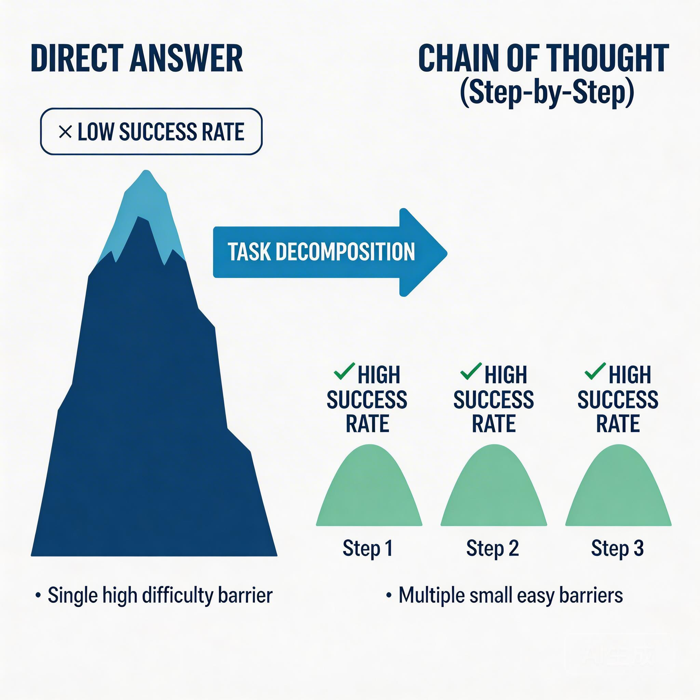

# 提示词技巧的兴衰：从"必备技能"到"内置能力"

2023 年，"提示词工程师"成了一热门职位，年薪百万不是梦。

2025 年，这个词几乎从市面上消失了。

发生了什么？

不是提示词没用，而是**模型学会了"自己提示自己"**。

---

## 曾经的三件"神器"

如果你在 2023-2024 年用过 LLM 写代码，大概率学过这些技巧：

### 思维链（Chain of Thought）

```
请一步步思考，解决这个问题：
一个数组有 100 个元素，每个元素是前一个元素的 2 倍...
```

加上"一步步思考"，准确率能从 40% 提升到 80%。神奇。

### 角色扮演

```
你是一个有 10 年经验的资深前端工程师，擅长 React 性能优化。
请帮我审查这段代码...
```

给模型设个人设，输出质量明显提升。

### 结构化输出约束

```
请以 JSON 格式输出，包含以下字段：
{
  "issues": [...],
  "suggestions": [...]
}
```

不这么写，模型可能给你一坨难以解析的文本。

**这三招，曾经是 AI 辅助编程的"基本功"。**

---

## 它们为什么有效？

理解这一点，比学会这些技巧更重要。

### 思维链：降低每一步的"概率难度"

假设你要模型计算 `(17 + 28) × 3`。

**直接问**：模型要一次性算出正确答案，概率空间巨大。

**拆步骤**：
1. 先算 17 + 28 = 45
2. 再算 45 × 3 = 135

每一步都很简单，出错概率低。两步都对，结果就对。

**本质**：把一个"高难度动作"拆成多个"低难度动作"，降低每一步的概率门槛。



### 角色扮演：激活特定"能力区域"

第一课我们说过：模型的参数里存储了各种"能力模式"。

当你写"你是资深前端工程师"时，你在**引导模型的注意力**，让它激活与"前端工程"相关的参数区域，而不是"后端"、"数据分析"或"写小说"的区域。

**本质**：用上下文"定位"到模型的特定能力域。

### 格式约束：缩小输出空间

模型每输出一个 token，都在做概率选择。

不约束格式时，输出空间几乎是无限的：可以是散文、代码、表格、列表...

约束成 JSON 后，输出空间被大幅压缩：第一个字符只能是 `{`，第二个可能是 `"` 或换行...

**本质**：缩小搜索空间，提高命中正确答案的概率。

---

## 它们为什么正在消失？

不是这些原理失效了，而是**模型把这套逻辑"内化"了**。

### 思维链 → 推理模型

2024 年底开始，一类新模型出现了：

| 模型 | 特点 |
|------|------|
| OpenAI o1/o3 | 自动生成隐藏的思维链 |
| DeepSeek R1 | 展示完整推理过程 |
| Claude Sonnet 4 | Extended Thinking 模式 |
| 智谱 GLM-4.7 | 深度思考，交错式思维 |
| Kimi K2.5 | 原生多模态推理 |

你不用告诉它们"一步步思考"，它们自己就会。

**思维链从"外在技巧"变成了"内在能力"。**

### 角色扮演 → 意图理解增强

新一代模型对上下文的理解能力大幅提升。

你写"帮我优化这段 React 代码的渲染性能"，模型就能推断出：
- 你是前端开发者
- 你关心性能
- 你需要具体的优化建议

**不需要再写"你是前端专家"了，模型能从问题本身推断。**

### 格式约束 → API 级别支持

现在主流 API 都直接支持：

```python
# OpenAI
response = client.chat.completions.create(
    model="gpt-4o",
    messages=[...],
    response_format={"type": "json_object"}  # 直接要 JSON
)

# 或者用 Function Calling / Tool Calling
```

**不需要在提示词里"骗"模型输出 JSON 了，API 层面就支持。**

---

## 2026 年，还需要学提示词吗？

**需要，但重点变了。**

### 什么时候仍需手动引导

| 场景 | 为什么还需要 |
|------|-------------|
| 用旧模型（GPT-4、Claude 3.5） | 这些模型没有内置 CoT |
| 极其专业的领域 | 模型可能不知道你的"行话" |
| 需要特定格式 | API 级约束不够灵活时 |

### 更重要的能力

与其钻研"怎么写提示词"，不如提升这些能力：

1. **问题拆解**：把模糊需求变成清晰步骤
2. **结果验证**：怎么判断模型输出对不对
3. **反馈设计**：怎么用好"不对，再改改"

**从"写提示词"到"设计交互流程"。**

---

## 能力一：问题拆解

模型最怕的不是"难题"，而是"模糊的难题"。

### 模糊需求 vs 清晰步骤

**模糊需求**：
```
帮我写一个用户登录功能
```

模型会问你一堆问题：用什么认证方式？存哪？要不要记住我？

**拆解后**：
```
帮我实现用户登录功能：
1. 用邮箱 + 密码登录
2. 密码用 bcrypt 加密存储
3. 用 JWT 做会话管理，有效期 7 天
4. 登录失败 5 次锁定账户 15 分钟
```

这不是"写提示词技巧"，而是**你在写代码前先把需求想清楚**。

### 拆解的本质

| 模型视角 | 你需要做的 |
|---------|-----------|
| "写登录功能" → 概率空间巨大 | 缩小问题边界 |
| 每个约束都在排除"错误路径" | 明确技术选型 |
| 剩下的路径少了，正确率自然高 | 列出边界条件 |

**这能力迁移到任何领域都有价值，不只是 AI。**

---

## 能力二：结果验证

模型输出的代码，你怎么知道对不对？

### 三层验证法

**第一层：能跑吗？**

```bash
npm run build  # 编译通过？
npm test       # 测试通过？
```

这是最低门槛。但能跑 ≠ 对。

**第二层：符合预期吗？**

- 代码风格对吗？（看 Linter）
- 逻辑对吗？（看测试用例）
- 性能对吗？（看实际运行）

**第三层：有隐患吗？**

- 有安全漏洞吗？
- 有边界情况没覆盖吗？
- 和现有代码冲突吗？

### 验证的本质

模型输出的是"看起来对的代码"。**"看起来对"和"真的对"之间，隔着你的验证能力。**

这不是 AI 时代的新技能，而是程序员一直以来的核心能力——**Code Review 能力**。

只是现在，你在 Review AI 写的代码。

### 一个实践建议

把 AI 输出的代码当成"实习生提交的 PR"：
- 能跑？好，第一步
- 符合规范？检查
- 有隐患？仔细看
- 能合并？你来决定

**你不是"写代码的人"，你是"把关的人"。**

---

## 能力三：反馈设计

模型第一次输出不完美，太正常了。

关键是：**你怎么"告诉它哪里不对"。**

### 糟糕的反馈

```
不对，再改改
```

模型不知道"哪不对"，只能瞎猜。

### 好的反馈

```
这段代码有两个问题：
1. 没有处理用户不存在的边界情况（应该返回 404）
2. 密码比对应该用 bcrypt.compare，而不是直接比较字符串
```

**具体指出问题，模型才能精准修复。**

### 反馈的本质

| 你说的 | 模型听到的 |
|-------|-----------|
| "不对" | ??? |
| "逻辑有问题" | ??? |
| "第 15 行没有处理 null 的情况" | ✅ 明确修复方向 |

**反馈设计 = 把你的"直觉"翻译成"明确的约束"。**

### 多轮对话的正确姿势

```
第一轮：帮我实现登录功能 [给出拆解后的需求]
第二轮：测试没过，报错"Cannot read property 'password' of undefined"
        应该是 user 为 null 时没有处理，帮我加上
第三轮：好了，但 Linter 报错"no-unused-vars"，password 变量没用
        这个变量可以删掉
第四轮：通过 ✓
```

**不是"一次答对"，而是"快速收敛到正确答案"。**

---

## 从"提示词工程师"到"AI 协作设计师"

2023 年的"提示词工程师"：
- 研究怎么写"魔法咒语"
- 追求"一次答对"
- 把技巧当核心竞争力

2026 年的"AI 协作设计师"：
- **问题拆解**：把模糊变成清晰
- **结果验证**：把关 AI 输出质量
- **反馈设计**：高效引导修正方向
- **流程设计**：什么时候用 AI，什么时候人工

**提示词是工具，这些能力才是护城河。**

### 一个例子

2023 年的写法：

```
你是一个资深前端工程师。请一步步思考。
分析这段代码的性能问题，以 JSON 格式输出：
{
  "issues": [...],
  "suggestions": [...]
}
```

2026 年的写法：

```
这段代码在列表渲染时卡顿，帮我找找问题
```

**剩下的，模型自己会做。**

---

## 这告诉我们什么？

提示词工程的"消亡"，其实是一种"成功"。

它说明：**这些技巧 настолько 有效，以至于模型开发者把它们内置了。**

就像：
- 手动挡 → 自动挡（换挡技巧不再重要）
- 命令行 → 图形界面（记命令不再重要）
- 汇编 → 高级语言（理解寄存器不再重要）

**每次技术进步，都在把"技巧"变成"基础设施"。**

但理解原理的价值还在——当模型"翻车"时，你知道它为什么翻，怎么救。

---

## 总结

| 曾经的技巧 | 现在的状态 | 背后的原理（仍然有效） |
|-----------|-----------|----------------------|
| 思维链 | 推理模型内置 | 拆解任务降低概率难度 |
| 角色扮演 | 意图理解增强 | 激活特定能力区域 |
| 格式约束 | API 级支持 | 缩小输出空间 |

**提示词没有死，只是变成了模型能力。**

---

## 思考题

> 当模型能自己思考、自己规划、自己调用工具时，程序员的核心价值是什么？

提示：想想上一章提到的"方向盘 vs 引擎"——你不再是驾驶员，而是...？

---

## 延伸阅读

- [Chain-of-Thought Prompting Elicits Reasoning in LLMs](https://arxiv.org/abs/2201.11903)（2022，Google）
- [Large Language Models are Zero-Shot Reasoners](https://arxiv.org/pdf/2205.11916)（2022，"Let's think step by step" 的来源）
- [DeepSeek-R1 Technical Report](https://arxiv.org/pdf/2501.12948)（推理模型的训练方法）
