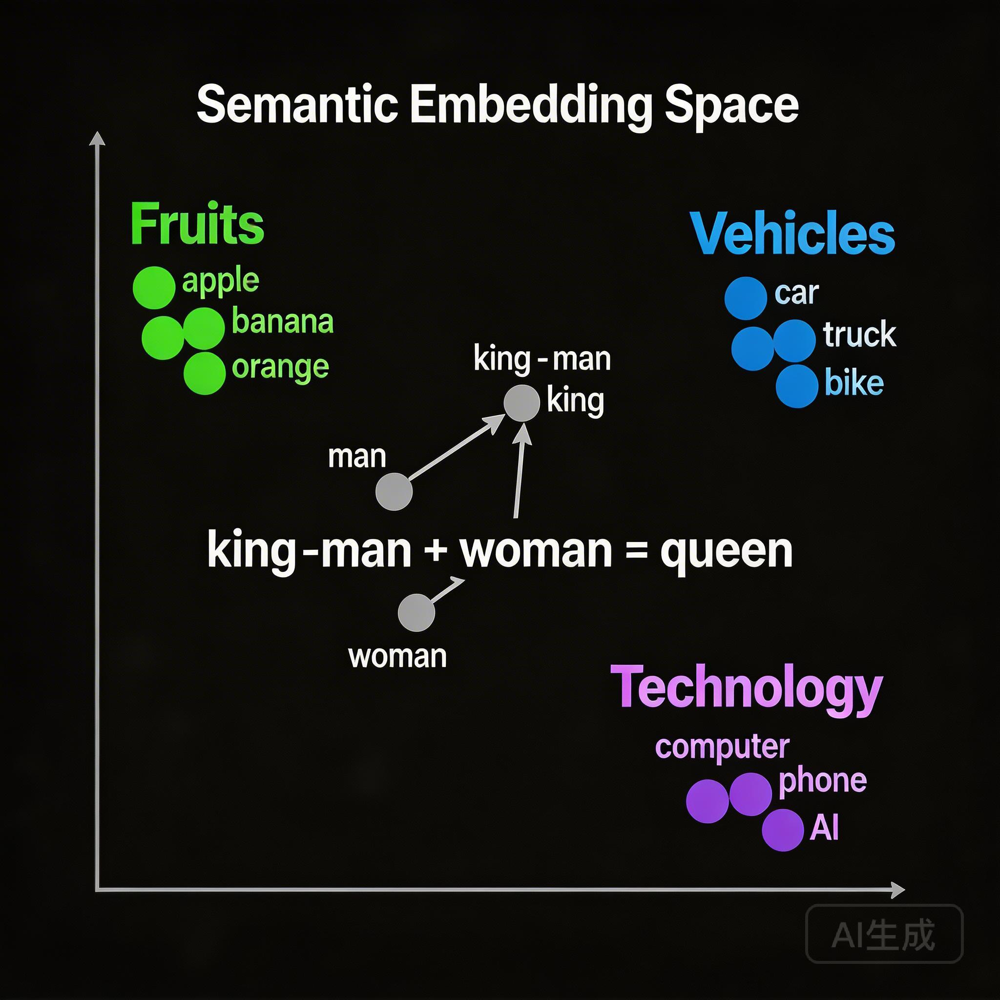

# RAG 与 Embedding：从文本到向量

第一课我们说过：模型的知识"凝固"在训练完成那一刻。

那企业私有文档、最新 API 文档、公司内部 Wiki——这些模型没见过的东西，怎么让它"知道"？

最直接的想法：把文档贴给它。但文档太多怎么办？几百万字，token 不够用。

**RAG 的思路：不全部喂，只喂"相关的部分"。**

问题是：怎么知道哪些部分"相关"？

答案：**Embedding**。

---

## RAG 的核心流程

RAG = Retrieval-Augmented Generation（检索增强生成）

三个步骤：

```
用户提问
    ↓
[检索] 在知识库里找相关内容
    ↓
[增强] 把找到的内容 + 问题一起喂给模型
    ↓
[生成] 模型基于检索内容回答
```

**核心洞察**：模型不需要"记住"所有知识，只需要在回答时"看到"相关知识。

### 为什么不直接全部喂？

假设你有 10,000 份文档，每份平均 5,000 字。

**方案 A：全部塞进 Context**
- 50,000,000 字 ≈ 25,000,000 tokens
- 成本：按 GPT-4 的价格，单次请求几千美元
- 延迟：等几分钟才出结果
- 还有个问题：Lost in the Middle，模型"看"不到那么多内容

**方案 B：RAG**
- 检索最相关的 5 份文档
- 25,000 字 ≈ 12,500 tokens
- 成本：几毛钱
- 延迟：几秒
- 模型能真正"看到"这些内容

**RAG 本质上是一种"信息过滤"——从海量数据中筛出有用的部分。**

---

## Embedding：把文字变成坐标

怎么"检索"相关内容？传统的关键词搜索？

问题来了：

```
用户问：如何优化数据库查询性能
文档里写：MySQL 索引设计与 SQL 调优指南
```

关键词完全不匹配，但语义高度相关。

**我们需要的是"语义检索"，不是"关键词匹配"。**

### 从 One-hot 到 Embedding

**One-hot 编码**：给每个词一个独立的编号

```
苹果 → [1, 0, 0, 0, 0, ...]
香蕉 → [0, 1, 0, 0, 0, ...]
汽车 → [0, 0, 1, 0, 0, ...]
```

问题：
1. **维度爆炸**：有多少词就有多少维
2. **无语义关系**："苹果"和"香蕉"的距离，与"苹果"和"汽车"的距离是一样的

**Embedding**：把词映射到一个低维、稠密的向量空间

```
苹果 → [0.2, 0.8, 0.1, ...]
香蕉 → [0.25, 0.75, 0.12, ...]
汽车 → [0.9, 0.1, 0.85, ...]
```

在 Embedding 空间里：
- "苹果"和"香蕉"的向量很接近（都是水果）
- "苹果"和"汽车"的向量很远（没什么关系）



### 那个著名的例子

```
国王 - 男人 + 女人 ≈ 女王
```

这不是魔法，是向量运算：

```
[国王的向量] - [男人的向量] + [女人的向量]
≈ [女王的向量]
```

**几何直觉**：
- "国王"和"女王"的差异 ≈ 性别差异
- "男人"和"女人"的差异 ≈ 性别差异
- 所以：国王 - 男人 + 女人 ≈ 女王

**Embedding 捕捉到了"语义关系"，并编码成几何关系。**

### 句子也能 Embedding

不只是词，整句话也可以变成向量：

```
"如何优化数据库查询" → [0.3, 0.7, 0.2, ...]
"MySQL 索引设计指南" → [0.28, 0.72, 0.19, ...]
"今天天气不错"       → [0.9, 0.1, 0.85, ...]
```

前两句的向量很接近，第三句很远。

**这就是语义检索的基础：把问题和文档都变成向量，找距离最近的。**

---

## Embedding 模型：文本到向量的编码器

Embedding 不是魔法，是一个神经网络模型。

### 它做什么？

输入：一段文本
输出：一个向量（通常是 768 维、1024 维或 1536 维）

```python
from openai import OpenAI
client = OpenAI()

response = client.embeddings.create(
    model="text-embedding-3-small",
    input="如何优化数据库查询性能"
)

vector = response.data[0].embedding  # 一个 1536 维的向量
# 例如: [0.012, -0.034, 0.056, ..., 0.078]
```

### 主流 Embedding 模型（2025-2026）

根据 [MTEB 排行榜](https://huggingface.co/spaces/mteb/leaderboard)的最新数据：

| 模型 | 提供方 | 维度 | 价格（每百万 token） | 特点 |
|------|--------|------|---------------------|------|
| **Gemini Embedding** | Google | 768 | 按云服务计费 | MTEB 排名靠前，多语言支持 |
| **Qwen3-Embedding-8B** | 阿里 | 4096 | **免费（开源）** | 开源最强，中文优秀 |
| **Voyage-3-large** | Voyage | 1536 | ~$0.12 | 检索质量顶级，前 2 亿 token 免费 |
| **text-embedding-3-small** | OpenAI | 1536 | $0.02 | 性价比高，生态完善 |
| **text-embedding-3-large** | OpenAI | 3072 | $0.13 | 更精确，适合高要求场景 |
| **BGE-M3** | 智源 | 1024 | **免费（开源）** | 中文最佳，多语言多粒度 |

### 怎么选？

**中文为主**：BGE-M3 或 Qwen3-Embedding，开源免费，中文效果最好

**通用场景 + 省心**：OpenAI text-embedding-3-small，API 简单，生态成熟

**精度要求高**：Voyage-3-large，检索质量顶级

**成本敏感 + 可自建**：Qwen3-Embedding 或 BGE-M3，完全开源，本地部署

**关键点：Embedding 模型决定了"相似"的定义，选错了会影响整个 RAG 系统的效果。**

---

## 向量检索：在高维空间找邻居

有了向量，怎么检索？

### 相似度计算：余弦相似度

两个向量的"相似度"，通常用**余弦相似度**（Cosine Similarity）：

```
cos(θ) = (A · B) / (|A| × |B|)
```

直觉：两个向量的夹角越小，越相似。

- 夹角 0° → 相似度 1（完全相同）
- 夹角 90° → 相似度 0（无关）
- 夹角 180° → 相似度 -1（完全相反）

### Top-K 检索

流程：
1. 把用户问题转成向量
2. 在向量数据库里找余弦相似度最高的 K 个文档
3. 返回这 K 个文档

```
问题: "如何优化数据库查询"
    ↓
Embedding → [0.3, 0.7, 0.2, ...]
    ↓
向量数据库检索
    ↓
Top 5 最相似的文档:
  1. MySQL 索引设计指南 (相似度 0.89)
  2. SQL 查询优化技巧 (相似度 0.85)
  3. 数据库性能调优实践 (相似度 0.82)
  4. PostgreSQL 执行计划分析 (相似度 0.78)
  5. Redis 缓存策略 (相似度 0.71)
```

### 一个重要的问题

**相似度高 ≠ 真的相关**

```
问题: "苹果手机怎么截屏"
文档: "苹果是一种营养丰富的水果，含有大量维生素..."
```

"苹果手机"和"苹果水果"的向量可能很接近（都包含"苹果"），但语义上完全不相关。

**这是向量检索的固有限制：它只看"语义相似"，不理解"意图"。**

解决方案：
- 混合检索：向量 + 关键词
- 重排序：用更精细的模型二次筛选
- 这些是进阶话题，工程化时再考虑

---

## RAG 的典型失败模式

知道 RAG 能做什么，也要知道它**做不到什么**。

### 1. 检索不到

知识库里根本没有相关内容，怎么检索都没用。

**现象**：模型开始"编"，或者老实说"不知道"

**解决**：扩充知识库，或者接受这个边界

### 2. 检索到了但没用上

你明明把相关文档塞进去了，模型却"假装没看见"。

**原因**：
- 文档太长，模型"迷失"了
- 关键信息在文档中间，被"忽略"了
- 文档写得太烂，模型理解不了

**解决**：这是下一课的主题——上下文工程

### 3. 需要综合多份文档

```
问题: "比较 MySQL 和 PostgreSQL 在高并发场景下的表现"
```

需要同时检索：
- MySQL 高并发相关文档
- PostgreSQL 高并发相关文档
- 两者的对比分析文档

**单次检索可能找不到"综合视角"，需要多轮检索或更复杂的设计。**

---

## 总结

| 概念 | 一句话解释 |
|------|-----------|
| RAG | 检索相关内容，喂给模型，让它基于内容回答 |
| Embedding | 把文本变成向量，让"语义相似"变成"向量接近" |
| 向量检索 | 在向量空间找最近的邻居 |
| 余弦相似度 | 衡量两个向量的"方向一致性" |

**核心认知**：RAG 的本质是**信息过滤**——从海量数据中筛出模型需要的那一小部分。

**局限性**：向量检索只看"语义相似"，不理解"意图"，可能检索到"看起来相关但实际无关"的内容。

---

## 思考题

> 如果你要给公司搭建一个"智能客服"RAG 系统，你会怎么处理以下问题？

1. 用户问的问题，知识库里没有怎么办？
2. 用户问"上次那个问题"，怎么理解"上次"？
3. 知识库每周更新，向量需要重新生成吗？

这些问题没有标准答案，但思考它们会让你对 RAG 的边界有更深的理解。